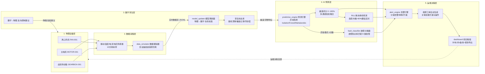

# Digital-Twin-Predictive-Maintenance-Platform

> 数字孪生驱动的设备智能运维平台 —— 让设备"开口说话"，把故障消灭在发生之前。

## 一、项目简介

本项目是一套面向工业设备（主电机、离心风机、齿轮传动箱）的**数字孪生 + AI 预测性维护**一体化演示平台。它以"物理设备实时数据"为输入，在信息空间中构建并持续校准设备的数字镜像，再由 AI 引擎对数字孪生的状态进行异常检测、健康评分与剩余寿命（RUL）预测，最终驱动告警引擎自动生成工单与处置方案，完成"**事后维修 → 事前预防**"的运维模式升级。

平台内置完整的数据闭环：**数据模拟器**可以仿真设备从健康到故障的全生命周期衰退过程（振动上升、温升加大、电流增加、转速下降），因此无需真实产线即可端到端体验预测性维护的全部能力；接入真实设备时，只需将模拟器替换为 OPC-UA / MQTT 采集程序，其余模块零改动。

## 二、闭环架构



数据闭环的三条关键链路：

1. **感知链路**：物理设备 → 传感器 → 数据模拟器 → 实时数据流（`data/stream/`）；
2. **孪生链路**：实时数据 → 数字孪生在线校准（EWMA 吸收基线漂移）→ 偏差记录与同步度评分 → AI 预测引擎；
3. **决策链路**：健康评分 / RUL / 故障归因 → 分级告警与工单 → 3D 看板可视化 → 反向控制建议回馈物理设备。

## 三、核心功能

| 功能 | 说明 |
| --- | --- |
| 数据模拟 | 3 台设备全生命周期衰退仿真，含 5 种故障模式注入（轴承磨损、转子不平衡、润滑不足、齿轮点蚀、绕组绝缘老化） |
| 数字孪生 | 物理-数字双向映射：在线校准基线参数、记录通道级偏差、输出同步度与反向控制建议 |
| 异常检测 | sklearn 可用时使用 IsolationForest，否则自动降级为 Mahalanobis 距离，任何环境可运行 |
| 健康评分 | 振动/温度/电流/电压/转速五通道加权融合，输出 0~100% |
| RUL 预测 | 健康评分退化趋势外推 + 拟合残差构造 80% 置信区间 |
| 故障诊断 | 8 类故障知识库签名匹配，输出置信度、处置方案与备件清单 |
| 告警工单 | 提醒/严重/紧急三级告警 + RUL 预测预警，自动生成工单并关联方案 |
| 3D 可视化 | Three.js 数字车间，设备颜色随健康评分绿→黄→橙→红渐变，点击查看详情 |
| 综合看板 | 实时曲线、健康趋势、设备总览、告警列表、预测报告（Markdown）一键导出 |

## 四、目录结构

```
Digital-Twin-Predictive-Maintenance-Platform/
├── README.md                        # 本文件
├── data-ingestion/
│   ├── data_simulator.py            # 数据模拟器(实时流 + 历史数据集生成)
│   └── historical_data.csv          # 历史训练数据集(686条, 含正常/故障前数据)
├── digital-twin/
│   └── model_updater.py             # 数字孪生模型更新器(双向映射/偏差记录)
├── ai-prediction/
│   ├── predictive_engine.py         # AI预测引擎(异常检测/健康评分/RUL)
│   └── fault_classifier.py          # 故障分类器(8类故障知识库)
├── visualization/
│   └── 3d_scene/app.js              # Three.js 3D数字车间
├── dashboard/
│   └── app.py                       # Flask综合看板(集成全部能力)
├── alerts/
│   └── alert_engine.py              # 告警引擎(分级告警/工单生成)
├── docs/
│   └── 系统设计说明书.md             # 完整设计文档(架构/算法选型/集成方案)
├── resume/
│   └── 项目总结.md                   # 第一人称项目总结
└── data/                            # 运行时目录(数据流/孪生状态/告警, 自动生成)
```

## 五、快速开始

### 环境要求

- Python 3.10+，依赖：`flask`、`numpy`（必需）；`scikit-learn`（可选，缺失时自动降级为纯统计实现）
- 现代浏览器（3D 场景需要 WebGL 支持，Three.js 与 Chart.js 通过 CDN 加载，首次打开需联网）

### 一键启动（推荐）

```bash
python dashboard/app.py
# 访问 http://127.0.0.1:5000
# 看板启动时会自动生成历史数据集并训练模型, 约 5~10 秒后出现数据
```

看板后台自动驱动完整闭环流水线：模拟器 → 数字孪生 → AI 预测 → 告警工单。演示节奏下设备约 7~9 分钟走完一个生命周期（每 2 秒推进 6 个模拟循环，三台设备寿命 1320~1560 循环），可点击"复位演示"重新观察。

### 分模块运行

```bash
# 1. 单独生成历史训练数据集
python data-ingestion/data_simulator.py --mode csv --rows-per-device 220

# 2. 训练预测引擎并查看训练摘要
python ai-prediction/predictive_engine.py --train

# 3. 故障分类器/告警引擎自检
python ai-prediction/fault_classifier.py --selftest
python alerts/alert_engine.py --selftest

# 4. 数字孪生单步演示(快进900循环, 观察偏差演化)
python digital-twin/model_updater.py --once

# 5. 实时数据流模式(供孪生跟随消费)
python data-ingestion/data_simulator.py --mode stream --interval 1
python digital-twin/model_updater.py --follow
```

## 六、关键设计决策

1. **零依赖降级**：所有 AI 组件在 sklearn 缺失时自动切换到 numpy 统计实现（Mahalanobis 异常检测、规则阶段分类、最小二乘趋势外推），保证演示环境开箱即用；
2. **规则 + 数据双引擎诊断**：故障知识库的物理签名匹配提供可解释归因，随机森林提供统计判别，两者互补；
3. **数字孪生可解释同步**：每次同步输出通道级"实测 vs 模型"残差与同步度评分，偏差即早期故障特征来源；
4. **预测驱动工单**：RUL 低于 72 小时或健康评分跌破阈值时自动生成工单，处置方案与备件清单直接来自故障库，形成管理闭环。

更多架构细节、算法选型论证（LSTM vs 随机森林）与真实产线集成方案，请阅读 [`docs/系统设计说明书.md`](docs/系统设计说明书.md)。
