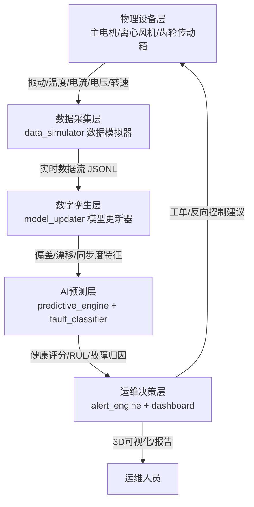

# 数字孪生预测性维护平台 · 系统设计说明书

> 版本：v1.1 ｜ 日期：2026-09-01 ｜ 适用范围：Digital-Twin-Predictive-Maintenance-Platform 全部模块
> （v1.0：2026-08-22 初版；v1.1：按审查报告 07 修正健康评分死区与校准说明（§6.3）、RUL 置信区间公式（§6.4），并以真实运行输出重写测试与验证章节（§14））

---

## 目录

1. [项目背景与建设目标](#1-项目背景与建设目标)
2. [数字孪生概念介绍](#2-数字孪生概念介绍)
3. [系统总体架构](#3-系统总体架构)
4. [数据采集层设计](#4-数据采集层设计)
5. [数字孪生层设计](#5-数字孪生层设计)
6. [AI 预测层设计](#6-ai-预测层设计)
7. [预测性维护算法选型论证（LSTM / 随机森林）](#7-预测性维护算法选型论证)
8. [故障知识库与混合诊断设计](#8-故障知识库与混合诊断设计)
9. [告警引擎与工单闭环设计](#9-告警引擎与工单闭环设计)
10. [可视化与看板设计](#10-可视化与看板设计)
11. [数据模型与接口设计](#11-数据模型与接口设计)
12. [与现有系统的集成方案](#12-与现有系统的集成方案)
13. [部署方案](#13-部署方案)
14. [测试与验证](#14-测试与验证)
15. [系统局限性与演进路线](#15-系统局限性与演进路线)

---

## 1. 项目背景与建设目标

### 1.1 维护模式的四次演进

工业设备的维护策略经历了四个发展阶段：**事后维修（Run-to-Failure）**——设备坏了再修，代价是突发停机与二次损坏；**定期维护（Time-Based Maintenance）**——按固定周期更换部件，代价是"过度维护"与维护成本居高不下；**状态维护（Condition-Based Maintenance）**——依据振动、温度等在线监测指标越限后干预，仍属"被动响应"；**预测性维护（Predictive Maintenance, PdM）**——基于数据模型提前预知退化趋势与剩余寿命，在最优时间窗口主动干预。 Industry 4.0 与 IoT 技术成熟后，PdM 的落地成本大幅下降，据美国能源部等机构的统计，成熟的预测性维护体系可将非计划停机时间减少 30%~50%，设备综合效率（OEE）提升 10%~20%，维护成本下降 15%~25%。

### 1.2 现状痛点

传统设备管理普遍存在四类痛点：其一，**数据孤岛**——振动、温度、电参量分散在不同系统，缺乏统一的数据资产；其二，**机理与数据脱节**——采集了数据但没有与之对应的设备行为模型，异常"看得见、说不清"；其三，**告警即事故**——告警阈值触发时往往已进入故障晚期，处置窗口极短；其四，**知识流失**——专家经验（故障特征、处置方案）存于个人头脑而非系统。

### 1.3 建设目标

本平台以数字孪生为骨架、AI 预测为大脑，目标建成"**感知—映射—预测—决策**"四位一体的设备智能运维闭环：实时感知五通道传感数据；以数字孪生模型持续映射物理设备状态并记录模型-实体偏差；由 AI 引擎输出健康评分、异常评分与剩余寿命（RUL）预测；最终自动驱动分级告警、维修工单与处置方案推荐，实现"**事后维修 → 事前预防**"的模式升级。平台同时沉淀故障知识库，把专家经验固化为可检索、可复用的数字资产。

---

## 2. 数字孪生概念介绍

### 2.1 定义

数字孪生（Digital Twin）是指充分利用物理模型、传感器更新、运行历史等数据，集成多学科、多物理量、多尺度、多概率的仿真过程，在虚拟空间中完成对物理实体的**全要素映射与全生命周期共演**，从而实现对物理设备的**镜像呈现、状态诊断与行为预测**。美国空军研究实验室（AFRL）2011 年首次提出该概念时，其核心诉求就是为战斗机机身建立伴随其全部飞行履历的数字镜像，以支撑结构寿命预测——这与本平台的预测性维护目标一脉相承。

### 2.2 四个层次的孪生形态

业界通常把"数字影子"到"数字孪生"的成熟度划分为四级，理解这一谱系有助于把握本平台的设计取舍：

| 层级 | 名称 | 数据流方向 | 特征 | 本平台对应 |
| --- | --- | --- | --- | --- |
| L1 | 数字模型（Digital Model） | 无自动数据流 | 离线机理/几何模型，人工同步 | 设备铭牌基线（nominal baseline） |
| L2 | 数字影子（Digital Shadow） | 物理 → 数字 单向 | 实体数据自动刷新模型 | 实时数据驱动孪生状态更新（P2D） |
| L3 | 数字孪生（Digital Twin） | 物理 ⇌ 数字 双向 | 模型变化可反作用于实体 | 反向控制建议（D2P，降载/巡检） |
| L4 | 孪生体协作（Twin Federation） | 多孪生协同 | 多设备/多系统孪生联动优化 | 演进路线（车间级调度优化） |

本平台实现了 L2~L3：`model_updater.py` 持续把实测数据吸收进数字模型（物理→数字），当偏差超限时生成反向控制建议回写物理侧（数字→物理）。

### 2.3 与传统监控、仿真的区别

与 SCADA 组态监控相比，数字孪生不只是"数据的可视化搬运"，而是维护一个**随实体共演的状态模型**：孪生体记录校准基线、负载因子、累计漂移等隐状态，能回答"设备现在应该是什么样"（模型期望值），从而把"实测值与期望值的偏差"作为异常检测的第一手特征。与离线 CAE 仿真相比，孪生体以轻量统计模型换取在线实时性，二者在生产体系中互补：机理仿真提供设计基线，孪生体负责运行期的快速共演。

### 2.4 本平台的孪生体内涵

每台设备在 `digital-twin/model_updater.py` 中的孪生体由三部分构成：**状态参数**（各通道校准基线、负载因子、EWMA 平滑残差）、**偏差记录**（每轮同步的通道级残差、MAPE、同步度评分、模型健康估计）与**反向建议**（偏差超限时的降载/巡检/启停建议）。孪生状态持久化于 `data/twin/twin_state.json`，进程重启后可无缝恢复——这是孪生体"生命周期共演"的基本要求。

---

## 3. 系统总体架构

### 3.1 五层闭环架构

系统按"物理设备 → 数据采集 → 数字孪生 → AI 预测 → 运维决策"五层组织，形成闭环：



### 3.2 模块职责矩阵

| 模块 | 文件 | 核心职责 | 关键输出 |
| --- | --- | --- | --- |
| 数据模拟器 | `data-ingestion/data_simulator.py` | 设备全生命周期衰退仿真、故障注入、实时流与历史集生成 | `data/stream/*.jsonl`、`historical_data.csv` |
| 孪生更新器 | `digital-twin/model_updater.py` | 双向映射、EWMA 在线校准、偏差记录 | `data/twin/twin_state.json` |
| 预测引擎 | `ai-prediction/predictive_engine.py` | 异常检测、健康评分、RUL 与置信区间 | 评估报告 dict |
| 故障分类器 | `ai-prediction/fault_classifier.py` | 故障知识库签名匹配、方案推荐 | Top-K 故障与处置建议 |
| 定量评估 | `ai-prediction/evaluate.py` | 留出轨迹上的混淆矩阵/RUL 误差/CI 覆盖率评估 | `reports/evaluation_*.md/json` |
| 告警引擎 | `alerts/alert_engine.py` | 分级告警、抑制升级、工单生成 | `data/alerts/*.json` |
| 综合看板 | `dashboard/app.py` | 流水线编排、REST API、单页看板 | HTTP 服务 |
| 3D 场景 | `visualization/3d_scene/app.js` | 数字车间渲染、健康着色、点击详情 | WebGL 画面 |

### 3.3 运行时数据流时序

一次典型的闭环周期（演示节奏 2 秒，等价生产节奏 10 分钟）如下：

1. `DataSimulator.step_all()` 为三台设备各产生一条采样记录（含衰退趋势与故障特征）；
2. `StreamWriter` 将记录追加至 JSONL 数据流并刷新 `latest.json` 快照；
3. `TwinUpdater.update_all()` 对每台设备执行孪生同步：估计负载因子 → 计算通道残差 → EWMA 校准基线 → 更新偏差统计 → 必要时生成反向建议，随后持久化孪生状态；
4. `PredictiveEngine.assess()` 基于基线分布计算 z 分数、异常分与健康评分，并把健康评分追加进历史序列供 RUL 拟合；
5. `FaultClassifier.classify()` 用 z 分数特征在故障知识库中做签名匹配；
6. `AlertEngine.evaluate()` 依据健康阈值与 RUL 窗口产生告警并联动工单；
7. `DataStore` 把本轮结果写入内存数据仓，看板前端与 3D 场景轮询消费。

---

## 4. 数据采集层设计

### 4.1 设计原则

数据层的目标是以**统一的采样契约**屏蔽数据来源差异：无论来自模拟器、OPC-UA 采集还是 MQTT 网关，进入孪生层的数据记录都遵循同一 schema（device_id、timestamp、五通道数值、cycle）。演示环境中由模拟器供数，生产环境中替换为采集适配器即可，下游零改动。

### 4.2 设备台账与基线

平台内置三台典型旋转设备：MOTOR-001（45kW 主电机，1480rpm）、FAN-001（30kW 离心风机，980rpm）、GEARBOX-001（40kW 齿轮传动箱，1250rpm）。每台设备登记健康态基线（如主电机振动 1.6mm/s、温度 55℃、电流 82A、电压 380V）与寿命循环数。基线既是孪生体的"出厂状态"，也是 AI 引擎健康样本筛选的锚点。

### 4.3 衰退模型

健康度按幂函数曲线演化：`h(t) = 1 - (t/T)^1.6`（T 为寿命循环数）。幂指数 1.6 刻画"先缓后急"的浴盆曲线后段——磨损型故障的典型非线性加速特征。各传感器通道对健康度的响应遵循物理规律：

- **振动**：`base × (1 + 3.2·(1-h)^1.7) × 负载因子`，轴承磨损类故障叠加周期性冲击尖峰（`0.3 + 0.4·(1-h)` 的幅值增益与 `sin(cycle/7)` 冲击调制）；
- **温度**：`base + 30·(1-h)^1.3`，叠加日周期环境波动（±3℃）与负载二次项；润滑不足/绝缘老化额外抬升 12·(1-h)℃；
- **电流**：`base × (1 + 0.22·(1-h)) × 负载因子`，绕组绝缘劣化再叠加 12% 增益；
- **电压**：围绕 380V 波动（σ=3.5V），重载退化阶段母线压降最多 6V；
- **转速**：`rated × (1 - 0.06·(1-h))`，转差率随退化增大，不平衡故障加剧转速抖动。

负载因子做随机游走（±15% 界内），模拟产线负荷波动，避免数据过于理想化——这对训练模型的鲁棒性至关重要。

### 4.4 故障注入计划

每台设备绑定 2 种典型故障模式，在健康度越过设定阈值时激活：轴承磨损（h≤0.60）、转子不平衡（h≤0.55）、齿轮点蚀（h≤0.50）、绕组绝缘老化（h≤0.45）、润滑不足（h≤0.40）。故障激活既改变传感器输出，也写入记录的 `fault_modes` 字段与 CSV 的 `fault_type` 标签列，形成带真值的监督样本。

### 4.5 历史数据集

`historical_data.csv` 由模拟器全生命周期扫描生成（每台设备约 220 个采样点，共 686 条），覆盖 normal（253 条）/ warning（132 条）/ fault（301 条）三种标签与全部 5 种故障模式组合。该数据集用于：健康基线估计、异常检测器训练、阶段分类器训练，以及 RUL 曲线的端到端验证。

---

## 5. 数字孪生层设计

### 5.1 双向映射机制

孪生层的核心是"**物理→数字（P2D）**"与"**数字→物理（D2P）**"两条链路：

**P2D 在线校准**：孪生体对每个通道维护校准基线（初始=铭牌值）。每条实测记录到来时，先由电流通道估计负载因子（平滑跟踪，界 0.80~1.20），再推演各通道期望值，计算残差 `residual = actual - expected`，最后以学习率 0.05 做 EWMA 校准 `calibrated += 0.05 × residual`（单次校准幅度限制在基线 2% 以内，防异常点污染模型）。校准后的基线即设备当前性能状态的"数字化身"——例如主电机振动基线从 1.6 缓慢爬升到 3.2，本身就刻画了轴承磨损的累积过程。

**D2P 反向控制**：当任一通道偏差率 |pct| ≥ 15% 时，孪生体按通道生成有物理依据的反向建议——振动超限建议降转速 10% 并安排轴承检查；温度超限建议降载 15% 并检查润滑回路；电流超限建议排查机械卡滞；电压超限建议检查供电回路。建议列表随孪生快照输出，模拟"孪生反哺物理世界"。

### 5.2 偏差记录与同步度

每轮同步输出通道级明细（实测/期望/残差/偏差率）、平均绝对偏差率（MAPE）与同步度评分 `sync = 100·exp(-8·MAPE)`。MAPE=0 表示实体与模型完全同步；同步度随偏差呈指数衰减，对早期漂移敏感。同时以"校准基线相对铭牌的累计漂移"结合同步度给出**模型视角健康估计** health_est，作为 AI 引擎评分的交叉验证源。

### 5.3 状态持久化与恢复

孪生状态（校准基线、负载因子、EWMA 残差、偏差历史、建议列表）实时落盘 `data/twin/twin_state.json`，进程重启自动恢复——保证孪生体的生命周期共演不因系统运维而中断。

---

## 6. AI 预测层设计

### 6.1 特征工程：z 分数标准化

所有推理建立在"实测值相对健康基线的标准化偏差"之上：`z = (x - μ_healthy) / σ_healthy`，其中 μ、σ 来自历史数据集中 label=normal 样本（无标签时回退为振动最小的前 25% 样本近似）。z 分数把异构量纲（mm/s、℃、A、V、rpm）统一到可比尺度，是异常检测、健康评分与故障匹配的公共特征底座。

### 6.2 异常检测：双引擎

- **主引擎 IsolationForest**：以健康样本训练无监督孤点森林（120 棵树，contamination=0.02），`decision_function` 经 sigmoid 映射为 0~100 异常分。孤立森林对多维联合分布异常（单通道正常但组合异常）敏感，且无需故障样本，契合工业界"正常数据多、故障数据少"的现实。
- **回退引擎 Mahalanobis**：sklearn 不可用时，在标准化空间估计协方差矩阵，计算马氏距离并映射为异常分。纯 numpy 实现，保证任何环境可运行。

### 6.3 健康评分：方向感知的加权融合 + 真值校准

健康评分将五通道恶化度加权融合为 0~100%：振动权重 0.35（机械故障最灵敏指示器）、温度 0.25、电流 0.20、电压 0.10、转速 0.10。恶化度计算区分通道方向性——振动/温度/电流为**单边恶化**（z>0.5σ 起算），电压/转速为**双边恶化**（|z|>0.8σ 起算）。

**去死区与标度校准（v1.1 修正）**：v1.0 单边通道 z>1σ 才起算、每 6σ 记满，导致评分在真值健康度 0.6~0.8 的"预测性维护黄金窗口"存在死区（留出轨迹实测 40% 样本被误判为 normal、35% 样本 RUL 不可估）。v1.1 分两步修正：

1. **去死区**：单边通道 z>0.5σ 起算，并按通道灵敏度分配满量程跨度——振动 42σ、温度/电流 20σ、双边通道 0.8σ 起算 8σ 记满。振动基线 σ 极小（z 呈爆炸式增长），跨度太小会过早饱和，太大则淹没温度/电流的有效信号，常数经真值上网格搜索确定；
2. **标度校准**：原始分对真值健康度单调但非线性，经**保序回归**（isotonic regression，分段线性表）映射为校准评分，使 score ≈ 100×真值健康度。映射常数与校准表在 4 条独立仿真轨迹（seed=2026/11/22/33，约 1.9 万样本）上池化标定，留出种子（7/44/55）验证评分与真值的中位偏差约 4 分（见 `reports/evaluation_report.md` 第 2 节校准表）。

需要说明：映射常数与校准表均为**离线标定**产物——等价于工业现场用失效数据离线标定评分模型；运行时推理不读取模拟器真值 health 字段（`assess()` 的设计约束不变）。留出集实测的阶段分类准确率 92.3%（宏 F1 0.890），黄金窗口漏检率由 40.3% 降至 25.8%，剩余误判集中在真值健康度 0.75~0.8 区间——该区间传感器信号仅约 1σ，与运行工况噪声同量级，属特征信息量决定的统计下限。

### 6.4 RUL 预测：趋势外推 + 置信区间

RUL 采用退化轨迹外推法：取最近 **144 个**健康评分点（覆盖温度日周期正弦的完整周期 144 循环，使日周期波动在斜率估计中正负抵消——v1.0 的 40 点窗口内日周期伪斜率与真实退化斜率同量级，是黄金窗口 RUL 大量"不可估"的主因）做最小二乘一次拟合，得到每 tick 退化速率 b；外推至失效阈值（35 分，校准评分下对应真值健康度约 0.35）得剩余 tick 数，按每 tick 10 分钟换算为小时。

**置信区间（v1.1 修正量纲错误）**：v1.0 把"评分点"量纲的残差 margin 直接乘 TICK_HOURS 换算小时，得到"评分点×小时/tick"的错误量纲——|b| 越小（慢退化，恰是 RUL 最有价值的早期）CI 被压得越窄。v1.1 采用标准线性外推预测方差：残差 σ 先按 `margin_score = 1.2816·σ·sqrt(1 + 1/n + (k-x̄)²/Sxx)` 放大到失效时刻（k 为外推步数，x̄/Sxx 为拟合窗口的均值与平方和，1.2816 为标准正态 80% 分位点），再**除以拟合斜率绝对值 |b|** 换算为小时。慢退化时 CI 随外推距离正确变宽（留出集实测 80% CI 覆盖率 24.5%，未达名义 80%——残差存在日周期/负载游走等自相关成分，独立同分布假设低估了长程不确定性，如实报告）。

RUL 输出经上限截断至 2160 小时（90 天）：退化早期斜率趋近于零，微小拟合斜率噪声会使外推产生无意义的巨额数值，截断是行业惯例（如 C-MAPSS 基准将 RUL 截断至 125 循环）。趋势同时被分类为 rising / stable / degrading / rapid_degrading / failed，未下降趋势不强行外推（返回 None 并标注），避免给出虚假的精确承诺。定量误差（中位相对误差、MAE、近失效窗口误差、提前归零尾巴）见 `reports/evaluation_report.md` 第 3 节。

### 6.5 劣化阶段分类

优先以历史标签训练随机森林（100 棵树，深度 8）输出 normal/warning/fault；sklearn 缺失时回退为健康评分阈值规则（>80 normal，>60 warning，其余 fault——校准评分 ≈ 100×真值健康度，阈值与模拟器标签边界 0.8/0.6 对齐）。数据驱动判别与规则兜底结合，使阶段判断在任何环境都有确定行为。留出集混淆矩阵与准确率见 `reports/evaluation_report.md` 第 1 节。

### 6.6 优雅降级策略

预测引擎启动时探测 sklearn 可用性并如实记录后端类型（sklearn / numpy-fallback），降级只影响方法学精度（孤立森林→马氏距离；随机森林→阈值规则），接口契约与输出 schema 完全一致。该设计让平台在最小依赖（仅 numpy+flask）下保持全功能演示能力。

---

## 7. 预测性维护算法选型论证

预测性维护的核心算法问题有三个：异常检测（无监督）、健康状态分类（监督）、剩余寿命回归（时序）。本章论证本项目的方法组合与取舍。

### 7.1 候选算法横向对比

| 维度 | LSTM/GRU 时序网络 | 随机森林 | IsolationForest | 本项目采用 |
| --- | --- | --- | --- | --- |
| 建模能力 | 任意非线性时序依赖，可学长期退化记忆 | 非线性表格特征，忽略时序 | 多维联合分布孤点 | — |
| 样本需求 | 数万条序列样本 | 数百条即可收敛 | 仅需正常样本 | 历史集仅 686 条 |
| 可解释性 | 弱（黑箱，需 SHAP 补偿） | 强（特征重要度、树路径） | 中（异常可定位到维度） | 要求"说得清为什么报警" |
| 推理成本 | 需 GPU/批量时序预处理，延迟高 | 毫秒级单条推理 | 毫秒级 | 每设备 10 分钟一条的轻量推理 |
| 工程复杂度 | 需 PyTorch/TF + 版本管理 + 序列窗口工程 | sklearn 即可 | sklearn 即可 | 演示环境不可强制依赖深度框架 |
| 小样本表现 | 易过拟合，需正则与增广 | 稳健 | 稳健 | 故障样本天然稀缺 |

### 7.2 为什么"现阶段"选择随机森林 + IsolationForest 而非 LSTM

**第一，样本量决定模型家族。** 本平台冷启动仅有 686 条历史样本（正常 253/预警 132/故障 301），LSTM 有序列窗口内的参数共享机制，理论上样本效率不错，但训练稳定收敛通常仍需万级序列片段；随机森林在数百条样本上即可达到可用精度，且对噪声标签稳健（模拟数据尚可，真实产线标签噪声更严重）。

**第二，可解释性是工业落地的硬约束。** 运维班组必须知道"为什么报轴承磨损"才敢停产检修。随机森林可输出特征重要度，配合故障库签名匹配给出通道级证据（如"振动 +7.0σ 命中特征区间，证据强度 100%"）；LSTM 的预测需额外 SHAP/注意力可视化补偿，工程链路显著加长。

**第三，推理时延与部署成本。** 预测引擎需要嵌入孪生同步循环（每设备每 10 分钟一次）并在告警风暴时批量评估。随机森林/孤立森林单条推理毫秒级、CPU 即可；LSTM 需维持序列窗口状态与张量预处理，在边缘侧部署成本高一个数量级。

**第四，退化模式当前近似单调。** 本平台的健康评分序列由缓慢衰退主导，一次趋势外推已能给出带置信区间的 RUL；LSTM 的优势（多阶段退化切换、非单调工况扰动下的长期记忆）在当前数据形态下收益有限。

### 7.3 LSTM 的适用条件与引入路径

当以下条件成熟时，LSTM（或 GRU/TCN/Transformer）应作为 RUL 模块升级：**(a)** 接入真实产线并积累 ≥6 个月、≥10⁴ 条设备-日粒度序列；**(b)** 出现多阶段退化与工况切换（频繁变负载、批次生产）导致线性外推失效；**(c)** 需要频谱级输入（包络谱、阶次谱序列）建模轴承特征频率的演化。引入路径建议：先以 LSTM 复现当前趋势外推基线并离线对比（A/B 影子评估），指标稳定超越基线 10% 以上再灰度切换；同时保留随机森林作为冷启动与回退引擎——这与引擎现有的"sklearn 主 + 统计回退"双引擎架构一脉相承。

### 7.4 最终方法组合

| 问题 | 主方法 | 回退方法 | 理由摘要 |
| --- | --- | --- | --- |
| 异常检测 | IsolationForest | Mahalanobis 距离 | 无监督、小样本、多维联合异常敏感 |
| 阶段分类 | 随机森林 | 健康评分阈值规则 | 小样本稳健、可解释、毫秒推理 |
| RUL 回归 | 健康趋势最小二乘外推 + 残差置信区间 | —（趋势不足时拒判） | 单调退化形态下最优性价比、自带不确定性度量 |
| 故障归因 | 知识库签名匹配（规则） | — | 可解释、可沉淀专家经验、与学习模型互补 |

---

## 8. 故障知识库与混合诊断设计

### 8.1 知识库结构

故障库（`fault_classifier.py` 内置 8 类）每条记录包含：编码/名称/部件、适用设备类型、**特征签名**（各通道的期望 z 区间与证据权重）、严重度、风险窗口（小时数）、典型症状、处置方案步骤与备件清单。签名示例——轴承磨损：`vibration ∈ [2.5σ, +∞) 权重3.0；temperature ∈ [1σ, 6σ] 权重1.5；current ∈ [0σ, 3σ] 权重0.5`。

### 8.2 分级证据评分

分类器采用**连续分级证据**而非二值命中：开口区间的证据强度从下界起随偏离加深线性爬坡（至下界 2 倍处满分），有界区间落入即满分，方向相反的观测按 30% 权重扣分。总分归一化为 0~1 置信度，Top-K 输出并注明每条证据。该设计解决了"多故障同时 100% 命中无法排序"的问题——例如电流 4.5σ、温度 2.6σ 的组合会判"机械过载（89%）"而非"润滑不足"，因为后者温度证据刚过下界、强度不足。

### 8.3 规则与模型的混合诊断

规则库的物理签名提供"可解释归因"，学习模型（随机森林）提供"统计判别"，二者输出在告警详情中并列呈现：健康评分与阶段来自学习引擎，故障名称与处置方案来自知识库。这种"AI + 专家经验"的混合架构是工业诊断系统的主流范式——模型负责发现"有异常"，知识库负责回答"是什么、怎么办"。

---

## 9. 告警引擎与工单闭环设计

### 9.1 双触发规则

告警引擎由两类信号触发：**阈值规则**——健康评分跌破 75 提醒（warning）、55 严重（critical）、35 紧急（emergency）；**预测规则**——RUL 低于 72 小时且评分尚可时发出预测预警（predictive），这正是"事前预防"的核心动作：在设备还能运行时就锁定检修窗口。

### 9.2 抑制与升级

同级告警 60 秒抑制窗口（生产建议 6~12 小时）防止告警风暴；高级别告警出现时自动关闭同设备低级别活动告警（superseded）并继承上下文，保证每台设备任一时刻只有一条"当前最要紧"的告警。

### 9.3 工单自动生成

严重/紧急告警触发工单自动创建：工单携带设备、故障编码与置信度、处置方案（来自故障库 Top 匹配，去重合并）、备件清单、处置时限（取故障风险窗口）。看板支持一键"完成维修"关闭工单并联动关闭来源告警，形成"**告警 → 诊断 → 工单 → 闭环确认**"的完整管理链路。

---

## 10. 可视化与看板设计

### 10.1 3D 数字车间（Three.js）

3D 场景以程序化建模构建车间：地面、安全黄线、四角支柱与三点光源营造纵深；三台设备各有精细结构——主电机（本体+散热筋+端盖+转轴+接线盒）、离心风机（蜗壳+六叶轮+进风喇叭口+排风管+桁架支腿）、齿轮箱（两级箱体+大小啮合齿轮+联轴器+油位视镜）。**健康着色**是该层的核心语义：设备本体颜色在绿(100)→黄(75)→橙(55)→红(0) 四锚点间随健康评分连续插值，运维人员一眼即可巡检全车间。**运转动画**（转子/叶轮/齿轮啮合）转速随健康度衰减（`base × (0.3 + 0.7h)`），顶部信标灯呼吸频率随严重度加快，强化"设备在变坏"的直觉。交互上支持轨道控制（拖拽/缩放/平移）、射线拾取悬停高亮、点击弹出详情面板（健康/RUL/疑似故障/处置建议，实时拉取预测接口）。场景在 `file://` 直开时自动进入独立演示模式（正弦健康度波动），便于脱离后端演示。

### 10.2 综合看板（Flask 单页）

看板页面四区联动：3D 车间（左上）、实时传感器四通道双轴曲线（左下）、健康评分趋势曲线（右上）、设备总览表与告警工单表（右下）。前端 3 秒轮询刷新，支持设备切换、预测报告（Markdown）一键导出、工单完成确认与演示复位。后端所有数据经 REST API 提供，与页面解耦，便于二次开发接入大屏。

---

## 11. 数据模型与接口设计

### 11.1 数据契约

**实时采样记录**（JSONL，每行一条）：

```json
{
  "device_id": "MOTOR-001", "device_name": "主电机", "device_type": "motor",
  "cycle": 320, "timestamp": "2026-01-03T13:20:00",
  "vibration": 2.87, "temperature": 61.4, "current": 87.2,
  "voltage": 379.1, "rpm": 1466.3,
  "health": 0.7412, "stage": "轻度衰退", "label": "warning",
  "fault_modes": ["bearing_wear"]
}
```

**历史数据集**（CSV）：`timestamp, device_id, device_name, cycle, vibration, temperature, current, voltage, rpm, health, stage, label, fault_type`，686 行，含正常运行与故障前全阶段样本。

### 11.2 REST API 一览

| 方法 | 路径 | 说明 |
| --- | --- | --- |
| GET | `/api/devices` | 全部设备最新状态（健康/异常/RUL/五通道） |
| GET | `/api/realtime/<id>` | 单设备最近 120 条实时序列 |
| GET | `/api/health/<id>` | 单设备健康评分历史 |
| GET | `/api/prediction/<id>` | 最新预测 + 故障归因 + 孪生摘要 |
| GET | `/api/twin` | 数字孪生全量快照 |
| GET | `/api/alerts` | 活动告警列表 |
| GET | `/api/workorders` | 未关闭工单列表 |
| POST | `/api/workorders/<id>/close` | 关闭工单（联动关闭告警） |
| POST | `/api/reset` | 复位演示 |
| GET | `/api/export/report` | 下载 Markdown 预测报告 |
| GET | `/3d/app.js` | 挂载 3D 场景脚本（同源） |

---

## 12. 与现有系统的集成方案

### 12.1 集成总体思路

平台采用"**数据接入适配 + 服务北向开放**"的集成策略：南向把数据采集层抽象为统一契约（见 11.1），真实产线以适配器替换模拟器；北向以 REST API 对接既有企业系统，工单与告警可双向同步。

### 12.2 南向：数据接入

| 现有系统 | 接入方式 | 实施要点 |
| --- | --- | --- |
| SCADA/DCS | OPC-UA 订阅（`asyncua` 库） | 点位映射表：OPC NodeID → 平台通道名；按 10 分钟聚合降采样 |
| 独立传感器/网关 | MQTT（主题 `plant/{line}/{device}/{channel}`） | QoS1 + 本地缓冲断点续传；边缘侧做滤波与丢包补偿 |
| 已有 historians（PI/InfluxDB） | API 批量拉取回填 | 用于冷启动历史训练集补齐 |
| 手抄巡检记录 | CSV/Excel 定期导入 | 补充离线点检数据，进数据湖统一治理 |

### 12.3 北向：企业系统集成

- **MES**：健康评分/RUL 通过 REST 推送，用于排产避让（RUL<72h 的设备不再排急单）；
- **ERP-PM/CMMS（Sap PM、Maximo 等）**：工单以工单中间表或 REST 双向同步——平台生成的工单（含故障码、备件清单）写入 CMMS，CMMS 的完成状态回写平台关闭告警；
- **企业告警中心**：告警经 Webhook/邮件/短信通道外发，消息体附 deep-link 直达看板设备详情；
- **数据湖/数仓**：JSONL 数据流按天归档 Parquet 入湖，供离线再训练与全厂级分析。

### 12.4 与"现有项目"集成的落地步骤

若在既有运维平台上叠加本能力，建议四步走：**第一步**边缘并行——部署采集适配器，孪生与预测引擎以影子模式运行 4~8 周，不影响既有告警；**第二步**指标对标——对比平台告警与既有系统的漏报/误报，调优基线与阈值；**第三步**工单试点——接入一台设备的 CMMS 工单闭环，验证方案推荐准确率；**第四步**全量推广——按设备类型分批纳入，知识库随维修反馈持续迭代。

---

## 13. 部署方案

### 13.1 演示部署（当前形态）

单进程：`python dashboard/app.py` 启动 Flask（threaded）+ 后台流水线线程，依赖仅 numpy/flask（sklearn 可选增强），数据落本地 `data/` 目录，适合工位演示与功能验证。

### 13.2 生产部署建议

生产形态将各层解耦为独立服务：采集适配器（边缘侧容器）→ 消息队列（Kafka/MQTT Broker，按设备分区）→ 孪生与预测服务（无状态多副本，模型经 MLflow 管理）→ 告警服务（含规则引擎与 CMMS 连接器）→ 看板（Nginx + Gunicorn）。数据流分层存储：热数据 Redis（最新快照）、温数据 TimescaleDB、冷数据对象存储 Parquet。监控上为流水线增加断流检测与模型漂移告警（基线分布 PSI 越界自动触发再训练）。

---

## 14. 测试与验证

以下全部为本仓库当前代码的真实运行输出（2026-09-01，Python 3.12，numpy 2.5.1，sklearn 未安装即 numpy-fallback 降级路径），每条均附复现命令。

1. **故障分类器自检**（`python ai-prediction/fault_classifier.py --selftest`，退出码 0）：4 个典型故障特征用例（轴承磨损/润滑不足/供电欠压/过载）全部命中预期故障码，置信度实测 100% / 87% / 100% / 89%；
2. **告警引擎自检**（`python alerts/alert_engine.py --selftest`，退出码 0）：健康评分 78→70→52→30 递进场景，验证"无告警→提醒→严重（生成工单）→紧急（升级+工单）"的分级与联动，生成 WO-0003 与 WO-0005 两张工单；
3. **端到端演示**（`python ai-prediction/predictive_engine.py --demo`，种子 7，快进 1300 循环，checkpoint {0,250,500,750,1000,1250} 实测健康评分）：主电机 **94.9→87.2→87.7→51.4→45.7→13.3**，离心风机 **94.9→89.2→94.9→64.7→52.5→24.4**，齿轮传动箱 **94.5→94.6→92.4→62.6→43.9→14.7**，阶段由 normal 经 warning 转入 fault；RUL 实测（种子 7）：250 循环时主电机 801.5h（80%CI 341.6~1261.3，早期外推距离长故区间宽）、齿轮箱 474.3h（295.5~653.1），750 循环时主电机收敛到 37.3h（27.9~46.8）。注意起点评分约 94~95 而非 100：校准评分输出的是"给定传感器读数时真值健康度的条件均值"，全新设备的工况波动使其略低于满分，属统计校准的诚实行为（见 §6.3）；
4. **看板接口测试**（Flask test client，不启动长驻服务）：12 条路由中 10 条 GET（首页、/3d/app.js、7 个数据 API、报告导出）全部 200，`POST /api/reset` 200 且复位后流水线可继续推进，`POST /api/workorders/<不存在的工单>/close` 正确返回 404；报告导出含中文文件名 RFC5987 编码，告警/工单 JSON 经原子写（临时文件 + os.replace）落盘后可正常加载；
5. **数字孪生演示**（`python digital-twin/model_updater.py --once`，种子 99，快进 900 循环，checkpoint {0,300,600,899} 实测同步度）：主电机 **84.4→70.5→79.6→60.8**，离心风机 **88.7→77.1→70.2→43.1**，齿轮传动箱 **85.9→77.4→85.2→75.9**，模型健康估计分别降至 0.00/0.20/0.42，偏差报告的通道级残差方向与故障注入一致（如主电机振动残差持续为正、齿轮箱电流残差随负载漂移）；
6. **AI 基线定量评估**（`python ai-prediction/evaluate.py`，评估轨迹种子 7，与训练集 2026 无样本重叠；工件见 `reports/evaluation_report.md` 与 `evaluation_metrics.json`）：留出轨迹 4695 样本上，阶段分类准确率 **92.3%**（宏 F1 0.890）；真值健康度 0.6~0.8 黄金窗口内漏检率 **25.8%**（修复前 40.3%）、RUL 不可估 **9.8%**（修复前 35.1%）；RUL 中位相对误差 **81.9%**（修复前 94.7%）、MAE **362.3h**（修复前因 CI 量纲错误产生 10¹⁴ h 量级离群值）；80% CI 实测覆盖率 **24.5%**（修复前 1.2%，未达名义 80% 的原因与 RUL 误差解读见评估报告）。RUL 置信区间单元用例（`python ai-prediction/evaluate.py --selftest`）：快/慢退化两场景 PASS——慢退化用例在修复前因 CI 过窄无法覆盖真值而 FAIL。

---

## 15. 系统局限性与演进路线

当前版本为演示级完整闭环，存在四项已知边界：退化模型为单一幂函数族，真实设备存在多阶段与突变型故障；RUL 为一次趋势外推，不处理退化拐点（留出集实测全周期中位相对误差 81.9%、80% CI 实测覆盖率 24.5%，见 `reports/evaluation_report.md`——残差自相关与凸性偏差使定量精度受限，属方法下限）；故障库 8 类模式覆盖旋转设备主流故障但未含电气谐振、基础共振等低频事件；孪生体为统计型轻量模型，未融合有限元机理模型。

演进路线按优先级排布：**(1) 频谱特征升级**——接入包络谱/阶次谱特征，轴承特征频率直接进故障签名；**(2) LSTM/TCN 时序模型**——数据积累达标后按 7.3 节路径引入，处理多阶段退化；**(3) 机理-数据融合孪生**——以降阶有限元模型替换统计基线，提升期望值物理保真度；**(4) 多设备孪生协同（L4）**——车间级联动优化（错峰降载延长整线 RUL）；**(5) 知识库自动进化**——从维修工单反馈中半自动挖掘新故障签名，专家标注后入库。

---

## 附录：术语表

| 术语 | 全称 | 释义 |
| --- | --- | --- |
| RUL | Remaining Useful Life | 剩余寿命：设备退化至失效阈值前的可用时长 |
| PdM | Predictive Maintenance | 预测性维护 |
| OEE | Overall Equipment Effectiveness | 设备综合效率 |
| EWMA | Exponentially Weighted Moving Average | 指数加权滑动平均 |
| MAPE | Mean Absolute Percentage Error | 平均绝对百分比误差 |
| CI | Confidence Interval | 置信区间（本平台输出 80% CI） |
| P2D / D2P | Physical-to-Digital / Digital-to-Physical | 物理→数字 / 数字→物理 映射方向 |
| CBM | Condition-Based Maintenance | 状态维护 |
